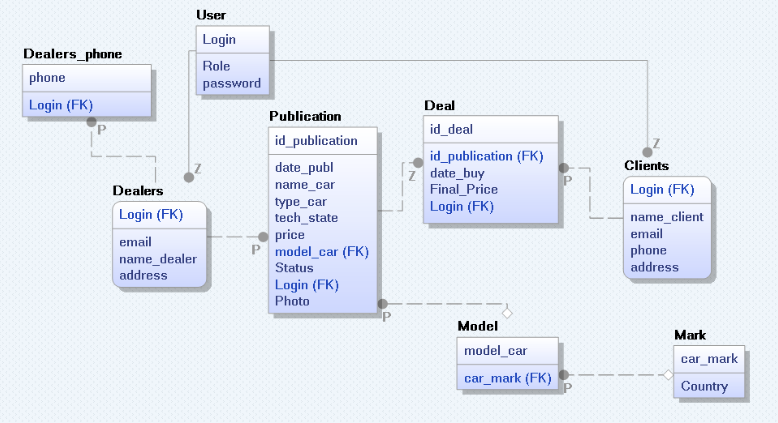

# DropCar

**DropCar** is a comprehensive system designed to manage the sale of used cars.

## Features
- Account system (Dealer, Client with db)
- Base CRUD system
- Integrated SSMS Sql database with Dapper
- Additional functions for managing sales ads

To run DropCar, you’ll need:
- SQL Server Management Studio (SSMS)
- [Kursachv8.mdf](https://drive.google.com/file/d/1NqZzfuNAm5nE-C3jnGJ3agnhbrqdM_R-/view?usp=sharing) (SSMS database) or change to your db
(Link also have detailed information about project)

 ## Erwin database schema
 ## 

